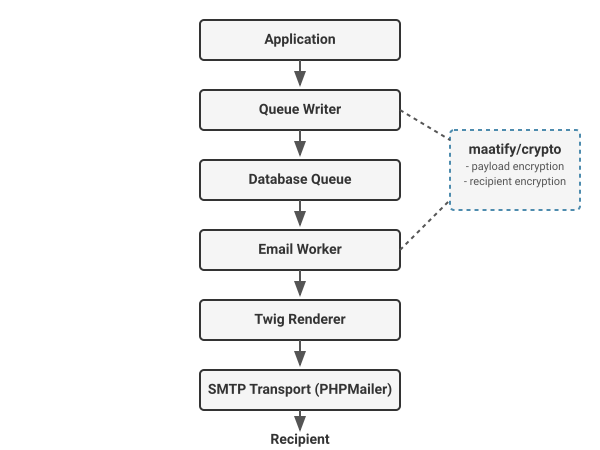
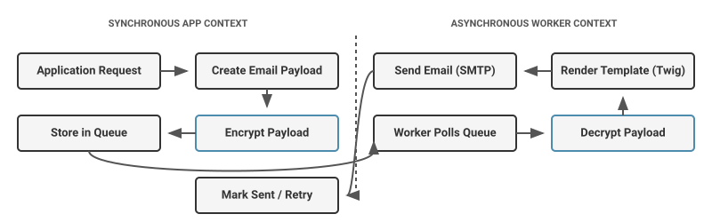
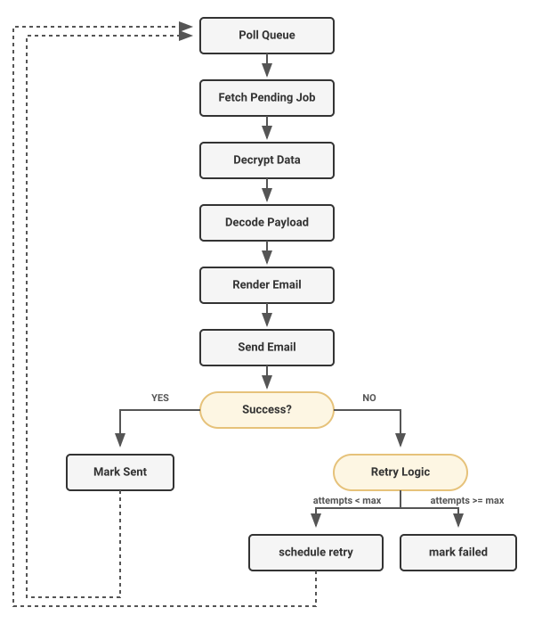

# Maatify Email Delivery

[](https://packagist.org/packages/maatify/email-delivery)
[](https://packagist.org/packages/maatify/email-delivery)
[](LICENSE)


[](CHANGELOG.md)
[](SECURITY.md)


[](SECURITY_AUDIT.md)


[](https://packagist.org/packages/maatify/email-delivery)


---

## Overview

**Maatify Email Delivery** is a standalone module for rendering, queueing, and sending transactional emails.

It provides:
- Async transactional email delivery
- Twig email rendering
- Queue-based delivery
- SMTP transport via PHPMailer
- Background worker processing
- Encrypted payload storage via `maatify/crypto`
- Framework-agnostic architecture

## Why This Library

This library solves several common problems in web applications:
- Synchronous email sending blocking requests and slowing down user responses.
- Unreliable delivery in high-volume systems when SMTP servers drop connections.
- Lack of templating systems for clean, maintainable transactional email layouts.
- Difficulty scaling email infrastructure.

By decoupling the process, the library introduces an robust **async email pipeline**.

## Features

- Async email queue
- Twig template rendering
- SMTP transport (PHPMailer)
- Background worker processing
- Encrypted queue payloads
- Retry mechanism for failed emails
- Framework-agnostic design
- Designed for transactional email systems

## Quick Example

```php
use Maatify\EmailDelivery\Queue\DTO\EmailQueuePayloadDTO;
use Maatify\EmailDelivery\Queue\PdoEmailQueueWriter;

// 1. Initialize Queue Writer
$queueWriter = new PdoEmailQueueWriter($pdo, $cryptoProvider, $cryptoContext);

// 2. Create Payload
$payload = new EmailQueuePayloadDTO(
    templateKey: 'welcome',
    language: 'en',
    context: ['name' => 'John Doe']
);

$email = 'john.doe@example.com';

// 3. Enqueue the email
$queueWriter->enqueue(
    entityType: 'user',
    entityId: '123',
    recipientEmail: $email,
    payload: $payload,
    senderType: 1,
    priority: 10
);
```

## Architecture Overview

The email delivery pipeline relies on four main components:
- **Renderer:** Compiles data and Twig templates into HTML/Text content.
- **Queue Writer:** Securely encrypts and stores the payload in the database queue.
- **Worker:** A background process that decrypts, renders, and attempts delivery.
- **Transport:** The SMTP layer that physically sends the email.

```text
Application
      ↓
Queue Writer
      ↓
Database Queue
      ↓
Email Worker
      ↓
SMTP Transport
```

## Email Delivery Pipeline

```text
Request → Queue → Worker → SMTP → Recipient
```

This system intentionally decouples email sending from application requests. Your application immediately responds to the user while the background worker handles the potentially slow and error-prone process of rendering and SMTP transmission.

## System Diagrams

### Architecture


### Email Flow


### Worker Lifecycle


## Installation

```bash
composer require maatify/email-delivery
```

## Documentation

Book:
- [docs/book/README.md](docs/book/README.md)

Guides:
- [docs/how-to/README.md](docs/how-to/README.md)

Examples:
- [docs/examples/README.md](docs/examples/README.md)

## Ecosystem

This package is part of the **Maatify Ecosystem**.

It relies on the `maatify/crypto` dependency to provide robust encryption. Encryption is used specifically for queue payload security, ensuring that sensitive transactional data (like password reset tokens or PII) remains unreadable if the queue database is ever compromised.

## License

MIT License
